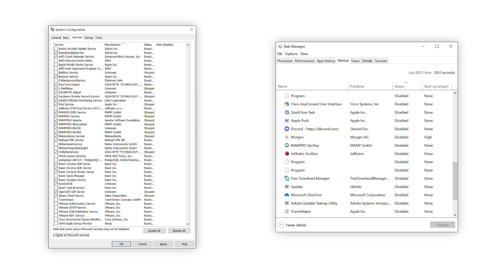

# Windows Performance Optimieren

Der Rechner startet und 8GB Ram sind erstmal verbraucht. Menschen die mit ihrem Rechner Lohnarbeiten und Zocken kennen das Problem. Im Autostart kräftig aufräumen und die Programme ausmisten hilft. 

Aber Vorsicht: Finger weg von allem, was du nicht kennst! Und besonders Finger weg von Microsoft kram! Das System durch Unkenntnis zerlegen ist nicht Ziel des Spiels.

 

## Startup

Erstmal läuft super viel, doch im Task Manager lässt sich nicht alles deaktivieren: Adobe Updater nur halb und der EA Background Service taucht gar nicht erst auf. Hier hilft einfach mal die Services in der System Config zu checken. Dinge die nicht einfach so loslaufen (siehe MAMPPRO) können getrost an gelassen werden.

***Screenshot von den Diensten und der Relevanten Sektion im  Taskmanager.*** _Interessant: Cisco und JetBrains kram war eigentlich Deaktiviert, Teile davon liefen aber weiter. Andere Programme sind nicht im Autostart, laufen aber trotzdem ungewollt mit._

Um die System Configuration oder den Task Manager zu öffnen reicht es die Windows Taste auf der Tastatur zu drücken und dann einfach den Namen vom Programm einzutippen.

Wenn immer noch Dinge Starten lohnt sich ein blick in den Startup Ordner, villeicht hast du ja selber mal was dort reingelegt und einfach vergessen. Dazu einfach beim Explorer `C:\Users\<dein username>\AppData\Roaming\Microsoft\Windows\Start Menu\Programs\Startup` in die Pfadzeile Tippen. Alternativ mit `Windows Taste + R` drücken um das "run" Fenster zu öffnen, dort `%AppData%` eingeben, `enter` drücken und ab einfach durchklicken. Oft existiert der Ordner aber gar nicht.

 

## Programme deinstallieren

Ein super tool ist [Bulk Crap Uninstaller](https://www.bcuninstaller.com/). Den ganzen nicht mehr benötigten Müll auf einen schlag deinstallieren geht super fix ohne Technisches wissen. Mit BCU können sogar vorinstallierte, sonst nicht deinstallierbare, Apps wie Xbox entfernt werden.

 

## Antivirus

Avast, Avira, Kaspersky, all dieser ganze Müll hat auf einem Windows 10/11 Rechner absolut NICHTS verloren. Windows bringt mit Windows Defender einen guten Schutz mit, der in Tests regelmäßig sehr gut abschneidet.

Zum tiefen Scannen von Torrents oder Sketchy Dateien bis zu 650Mb ist [Virustotal](https://www.virustotal.com/gui/home/upload) eh viel besser, hier wird mit sehr vielen verschiedenen Scannern geprüft.

Wenn der Rechner unnormal langsam ist oder komische Sachen macht kann mit dem [Malwarebytes ADW Cleaner](https://www.malwarebytes.com/adwcleaner) ein ausführlicher Scan gemacht werden, das findet auch Dinge die einfach nervig sind, unter Anderem Toolbars oder den Mist der von CHIP mit installiert wird.